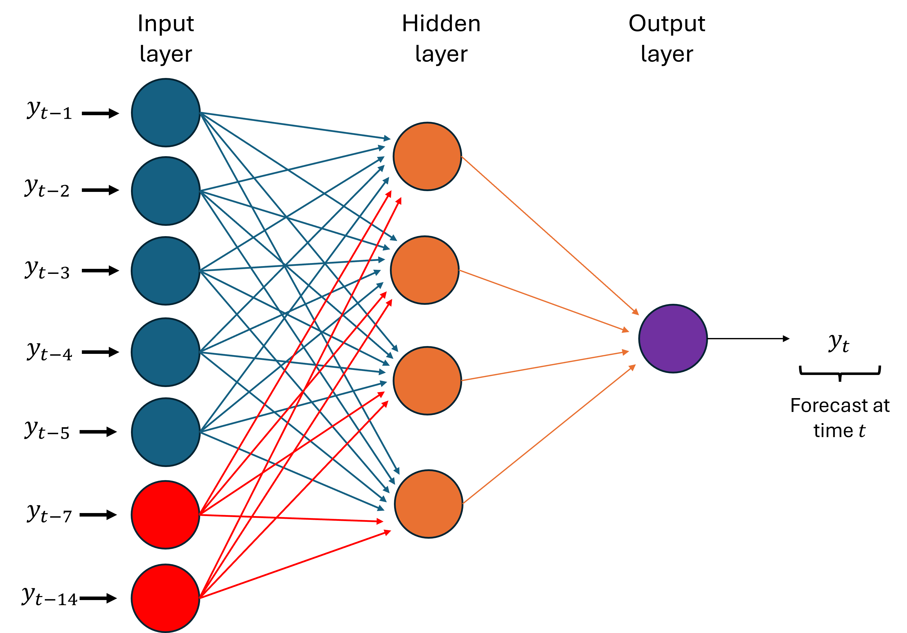
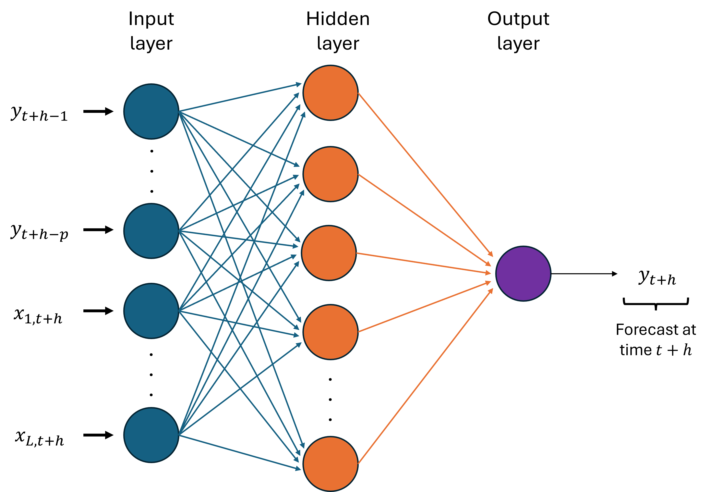

# Superiority of the Neural Network Dynamic Regression Models for Ontario Electricity Demand Forecasting

Electricity demand forecasting is an important step in balancing the electricity grid, and an accurate electricity demand forecast is a primary input to optimize production planning and scheduling. Depending on the industrial requirements, different time horizons may be imposed on electricity demand forecasting, and in some cases, forecasts may be computed for a few years. In electricity demand forecasting, the features such as temperature and day-type (weekday, weekend, or holiday) are suggested as the most influential features in the literature. The novelty of this work is to use Canadian electricity demand data and explore the effect of temperature and day-type on electricity demand using hybrid models. The hybrid neural network dynamic regression (NNDR) model is used to obtain the point forecasts/predictions for Ontario electricity demand data. Moreover, long-term point forecasts and innovations are used to obtain two classes of prediction intervals (PIs) using data-driven probabilistic innovation distribution and bootstrapping for NNDR, DRSARIMA and Prophet.

The PDF copy of the paper can be downloaded from here: [Download Paper](https://ieeexplore.ieee.org/abstract/document/9918212) 

A preprint version of the paper is available in the repository.

Programming Language: [R](https://cran.r-project.org/bin/windows/base/) / [RStudio](https://posit.co/downloads/)

Data: The electricity demand and temperature data used are available in the CSV file in the repository. The following are the sources of data:
1. Electricity Demand Data: [Independent Electricity System Operator](https://ieso.ca/en/)
2. Temperature Data: [Canada Weather Stats](https://www.weatherstats.ca/)

### Methodology

##### Dynamic Regression Model with SARIMA Errors (DRSARIMA)

The dynamic regression model with SARIMA $(p, d, q) (P, D, Q)_m$ errors is given by, for $t = 1, \dots, n$,
```math
y_t  = f (x_{1, t}, \dots x_{L, t}) + \eta_t
```
```math
\phi (B) \Phi (B^m) (1 - B)^d (1 - B^m)^D \eta_t  =  \theta (B) \Theta (B^m)  \epsilon_t
```
```math
\epsilon_t \sim IID (0, \sigma^2)
```
$(p, d, q)$ is the non-seasonal part of the SARIMA errors $\eta_t$ where $p$ is non-seasonal AR order, $d$ is the degree of non-seasonal differencing involved and $q$ is the non-seasonal MA order. $(P, D, Q)_m$ is the seasonal part of the SARIMA errors where $P, D, Q$ are the seasonal AR order, the degree of seasonal differencing, and the seasonal MA order, respectively. $m$ is the seasonal period. $y_1, \dots, y_n$ is the target series. $\epsilon_t$ are independent and identically distributed (IID) errors with mean 0 and variance $\sigma^2$. $f$ is a function of the $k$ features and $B$ is the differencing operator.

##### Neural Network Dynamic Regression (NNDR) Model

The neural network autoregressive (NNAR) model is a specialized variant of neural networks designed for time series forecasting. The model predicts future values based on past values. The NNAR model is regarded as a hybrid between traditional ARIMA models and machine learning approaches. Unlike ARIMA, which assumes a linear relationship between past and future values, NNAR can capture non-linear dependencies, making it particularly useful for complex real-world problems where such relationships exist.

The notation $NNAR(p,P,k)_m$ indicates a seasonal NNAR model with a single hidden layer. Here, $p$ is the number of lagged inputs, $P$ is the AR order of the seasonal part, $k$ is the number of nodes in the hidden layer, and $m$ is the seasonal period (daily/weekly).

The Figure below presents a $NNAR(p=5, P=2, k=4)_{m=7}$ model with 5 non-seasonal lags, 2 seasonal lags, 4 neurons in the hidden layer, and a seasonal period of 7.



The Figure below illustrates a typical NNAR Model with inputs of $L$ number of features. The output variable, $y_{t+h}$, depends on $p$ lagged values of the output variable as well as on the values of the features. This model is called the neural network dynamic regression (NNDR) model.



##### Prophet Model

Prophet is a time-series forecasting package developed at Facebook [1]. Prophet has three additive components in its forecast model. (1) Trend (growth $g$ over time, linear or nonlinear), (2) seasonality ($s$, within year), cyclicality (across years), and (3) holidays ($h$, irregular breaks).


### Findings

The experimental results show the superiority of the proposed NNDR model over the commonly used dynamic regression models with the Seasonal Autoregressive Integrated Moving Average errors (DRSARIMA) model and the Facebook Prophet model. Moreover, recently proposed data-driven probabilistic Student $t$ PIs have a higher coverage probability for the test sample than the bootstrap PIs for all three models (NNDR, DRSARIMA, and Prophet).

### References

1. Taylor, S. J., & Letham, B. (2018). Forecasting at scale. The American Statistician, 72(1), 37-45.


